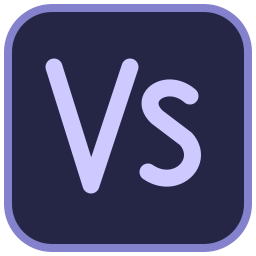

<div align="center">



# VideoSpace

**Local-first nonlinear editing. Custom Uno controls. GPU composition.**

[Open the editor](https://wieslawsoltes.github.io/VideoSpace/) · [User guide](docs/user-guide.md) · [Architecture](docs/architecture.md) · [Libraries](docs/libraries.md)

[](https://github.com/wieslawsoltes/VideoSpace/actions/workflows/build.yml)
[](https://github.com/wieslawsoltes/VideoSpace/actions/workflows/desktop.yml)
[](https://github.com/wieslawsoltes/VideoSpace/actions/workflows/engine.yml)
[](LICENSE)

</div>

---

VideoSpace is a real Uno WebAssembly and native desktop application: a frame-addressed C# editing engine, reusable custom controls, and a local browser media pipeline. No media upload service is required. The NORTH sample, vector icons and branding are original.

**Version `0.3.0-alpha.1`** adds two-source transitions, editable nested sequences, manually synchronized multicamera sources, prepared timeline/render/audio graphs, and indexed VP8/VP9 source decoding for offline WebM export. It is not complete or pixel-identical Adobe Premiere Pro parity. Read the [capability ledger](docs/limitations.md) for explicit platform and format boundaries.

## Edit, compose, deliver

The compact workspace contains Source and Program monitors, project bins, a multitrack timeline, Effect Controls, color presets, captions, history and metering. Resize panel dividers directly; switch among Editing, Color, Effects, Audio and Captions layouts. The controls are composed and styled for this application on Uno's input, focus and accessibility infrastructure.

Actual editing transactions support linked selection, snapping, movement, razor cuts, trimming, guarded ripple, roll, slip, rate stretch, insert/overwrite, clipboard operations, track controls and undo/redo. Invalid operations roll back rather than leaving partial edits. Smooth keyframe curves retain their original sample positions when clips are split or trimmed.

**Transitions** include cross dissolve, dips to black/white, directional wipes and constant-gain/power audio crossfades. They use real source handles and support centered, start-at-cut and end-at-cut alignment. Exhausted handles and overlapping transitions reject explicitly.

**Nested sequences** preserve editable tracks, effects, transitions, captions, markers and audio. Navigate into the child and return to the parent; saving and undo always retain the root document. Unnesting is guarded when outer transforms, trim or track settings would change the result.

**Multicamera sources** combine 2–16 sources with manual offsets and either fixed-angle audio or audio-follow-video. Insert the group and record camera cuts with keys 1–9 or Effect Controls. Automatic synchronization and a simultaneous camera grid are not implemented.

## Performance architecture

Prepared per-revision indexes replace repeated full-timeline scans for active clips, hit tests and visible ranges. Frame evaluation memoizes the paused result; the Uno/browser bridge avoids retransmitting unchanged presentation plans. The GPU graph renders nested sequences and transitions within one context, reuses targets/textures/uniforms, and skips unchanged source uploads. Audio compiles time/gain/pan/camera/transition chains once and queries only voices intersecting each sample block.

Tests measure an 80,000-clip active-query workload separately from index construction. Browser checks assert no additional evaluations, uploads or presentation frames while the editor is idle. These are scoped CPU/cache measurements, not a claim about all hardware or end-to-end export speed. See [performance and resource ownership](docs/performance.md).

## Platform matrix

| Capability | Browser | Native desktop |
| --- | --- | --- |
| Shared Uno editing workspace and transactions | Yes | Yes |
| Nested/camera/transition model and controls | Yes | Yes |
| Images, titles and generated footage | Yes | Yes |
| Imported video/audio playback | Browser-supported sources | Not yet |
| Composition | Hardware WebGPU → WebGL2 → reduced Canvas preview | Host-owned Skia canvas |
| Video export | Offline VP9/VP8 + Opus WebM | Not yet |
| Indexed source selection | Supported single-video VP8/VP9 WebM/Matroska | Not yet |
| PNG, native manifests, SRT, cuts-only EDL | Yes | Yes |
| Generated/nested PCM WAV | Yes | Yes |
| Live audio output | Web Audio | Not yet |
| Recovery | IndexedDB manifest and media | Manifest in application storage |

Output frames and stereo PCM have explicit timestamps. For supported indexed sources, packet presentation intervals and decoder output timestamps determine the source frame, including variable intervals and backward requests. Unsupported containers/features use a diagnosed browser-seeking fallback; arbitrary VFR/professional codec accuracy is not claimed. Limits and capability failures are explicit, not hidden frame freezes.

## Try it

Open the browser editor and press Space to play NORTH. Import local files, select an asset to open Source, mark its range, then use Clip → Insert/Overwrite or drag it onto a compatible track. Imported video receives linked audio. Save `.videospace` manifests regularly and keep the source files: IndexedDB recovery is not a backup.

Use Clip → Add / edit transition on an outgoing clip. Use Sequence → Nest selection for a complete temporal selection, or Create multicamera source for manually synchronized angles. The Help menu includes shortcuts, these workflows and export boundaries.

## Build

| Toolchain | Pinned version |
| --- | --- |
| .NET SDK | 10.0.401 |
| Uno SDK / WinUI | 6.7.30 / 6.7.135 |
| SkiaSharp | 3.119.2, matched managed/native ABI |
| Node / Playwright | 22 / 1.63.0 |

```sh
git clone https://github.com/wieslawsoltes/VideoSpace.git
cd VideoSpace
python3 scripts/fetch-assets.py
dotnet run --project tests/VideoSpace.Tests -c Release
dotnet run --project tests/VideoSpace.Parity.Tests -c Release

dotnet workload install wasm-tools --skip-manifest-update
dotnet publish src/VideoSpace.App -f net10.0-browserwasm -c Release \
  -o artifacts/publish -p:WasmShellWebAppBasePath=/VideoSpace/
python3 scripts/collect-site.py artifacts/publish artifacts/site
python3 scripts/serve-site.py --directory artifacts/site --port 4173
```

Open `http://localhost:4173/VideoSpace/`. Production browser GPU/media APIs need a secure context. Append `?gpu=off` to exercise WebGL2.

```sh
dotnet run --project src/VideoSpace.App -f net10.0-desktop \
  -p:VideoSpaceDesktopOnly=true
```

Linux requires a graphical session and Uno's native dependencies. Desktop CI compiles Windows, macOS and Linux; compilation is not native-media certification.

## Download

Every [release](https://github.com/wieslawsoltes/VideoSpace/releases/latest) ships a self-contained, single-file desktop app — no .NET install needed:

| OS | x64 | Arm64 |
| --- | --- | --- |
| Windows | `VideoSpace-<version>-win-x64.zip` | `VideoSpace-<version>-win-arm64.zip` |
| macOS | `VideoSpace-<version>-osx-x64.tar.gz` | `VideoSpace-<version>-osx-arm64.tar.gz` |
| Linux | `VideoSpace-<version>-linux-x64.tar.gz` | `VideoSpace-<version>-linux-arm64.tar.gz` |

Extract and run `VideoSpace` (`VideoSpace.exe` on Windows). Builds are not code-signed yet: on macOS clear the quarantine flag with `xattr -d com.apple.quarantine VideoSpace`; on Windows choose **More info → Run anyway** in SmartScreen. Verify downloads against `SHA256SUMS`. Releases also include the browser build and a source archive.

The libraries below are published to [NuGet.org](https://www.nuget.org/packages?q=VideoSpace), e.g. `dotnet add package VideoSpace.Core`.

## Reusable libraries

| Package | Responsibility |
| --- | --- |
| `VideoSpace.Core` | Media/sequence model, rational time, validation, prepared indexes |
| `VideoSpace.Editing` | Atomic edits, transitions, nesting, camera cuts, clipboard and history |
| `VideoSpace.Timeline` | Indexed geometry, hit testing, snapping and anchored zoom |
| `VideoSpace.Effects` | Prepared recursive frame plans and bounded graph expansion |
| `VideoSpace.Audio` | Prepared sample-clock mixing, waveform reduction and WAV |
| `VideoSpace.Documents` | Native manifests, SRT and guarded cuts-only EDL |
| `VideoSpace.Rendering` | Skia layer/transition/sequence rendering and PNG |
| `VideoSpace.Media` | Browser storage, GPU graph, media, packet indexing and codecs |
| `VideoSpace.Controls` | Custom Uno timeline, panels, monitors, bins, icons and fields |
| `VideoSpace.Workbench` | Embeddable editor and workflows |

The first six libraries do not depend on Uno. All ten are published to NuGet.org with symbols. Standalone JavaScript modules can also be reused independently; [examples](docs/libraries.md) explain ownership and revision boundaries.

## Validation and delivery

Build runs engine, editing, parity, native pixel and cross-runtime evaluation tests; publishes the real Uno browser output; and exercises actual pointer/keyboard interactions. Independent media tests inspect decoded export frames/audio and transition pixels. Indexed-source tests encode variable-timestamp color frames and verify forward/backward presentation selection and eviction-safe ownership.

**Release** runs for `v*` tags or a supplied manual version. It runs engine, fixture and frame-plan gates, publishes self-contained single-file desktop executables for Windows, macOS and Linux (x64 and arm64), builds the browser and source archives, packs all ten versioned libraries with symbols and emits `SHA256SUMS`. Tags attach all assets to a GitHub Release and publish the packages to NuGet.org with [Trusted Publishing](https://learn.microsoft.com/nuget/nuget-org/trusted-publishing) (OIDC, no stored API key) from the protected `nuget` environment. Manual runs are dry runs: they build and upload every asset as workflow artifacts but publish nothing.

Pages deployment requires application and media acceptance. The public verification job checks the exact deployed commit, then repeats application tests on the public URL. Source, logs, screenshots, benchmark JSON and encoded samples are retained as Actions artifacts. See [development](docs/development.md).

## License and independence

Original source, shaders, muxing/indexing code, icons and sample content are MIT licensed. Dependencies retain their own licenses; [third-party notices](THIRD_PARTY_NOTICES.md) include Uno, Skia, .NET and the OFL-licensed font. No Adobe source, artwork, font, footage or proprietary project-format implementation is included.

VideoSpace is independent and not affiliated with, sponsored by or endorsed by Adobe. Adobe Premiere Pro is a trademark of Adobe.
