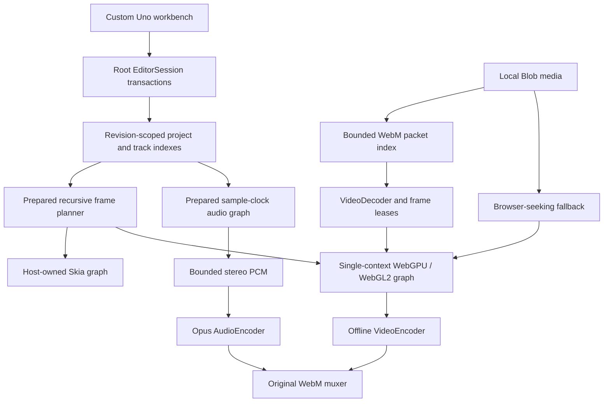

# Architecture

## Authority, identity and time

The C# session owns all user-visible editing. Browser modules receive evaluated plans and presentation rectangles, not mutation authority. Read-only control/state snapshots let tests locate a Skia-rendered UI; actual pointer and keyboard events execute commands.

Timeline positions are integer frames at a rational rate; source positions are seconds. Clip ranges are half-open. `AnimatedValue.FrameOffset` preserves the original curve's local time during split/trim, avoiding interpolation rebaking. Transition objects refer to adjacent clip identities and obtain overlap from validated source handles. Structural edits maintain references or remove detached transitions; invalid handles reject the transaction.

The session has one root document and a child navigation path. Mutations target the active sequence, but snapshots/save/recovery contain the root. Undo repairs a path whose ancestor was removed. Nesting retains editable tracks, markers, captions, transitions and audio; unnesting rejects cases that cannot preserve the composed result. Manually synchronized camera groups reference 2–16 local sources and store camera cuts as held integer-valued keys.

## Prepared execution

`ProjectIndex` owns read dictionaries and sorted clip/transition intervals for one revision. `PreparedFramePlanner` uses binary active-range lookup and memoizes one evaluated frame. Interactive hosts must reuse it until the session index changes. Recursive plans are bounded before bridge serialization.

`PreparedAudioMixer` compiles nested time maps, gain/pan stages, camera selectors and transition envelopes. Interval queries visit voices overlapping the sample block. The JavaScript evaluator/mixer is compared against independent C# fixtures at boundaries and fractional sample-clock positions.

The editing model still uses lists and bounded snapshot history. Read indexing is not a persistent structural-delta editing engine. See [performance](performance.md) for benchmark scope and lifetime rules.

## Compositing

The browser graph isolates nested sequences and transition inputs in same-device render targets. Premultiplied-alpha blending preserves lower layers correctly. Source textures, targets, uniform buffers and bind groups have explicit lifetimes; unchanged source versions skip uploads. Hardware WebGPU is preferred, WebGL2 is the supported software-adapter fallback, and Canvas 2D is reduced preview only.

Native Skia renders the same nested/transition plan using host-owned graphics resources. Images, text and generated sources work there; native video codecs and live audio remain absent. Pixel tests cover simple transition/alpha/nesting cases. The SDR grading pipeline is not a professional color-managed HDR system or a claim of universal cross-backend pixel identity.

## Indexed media and export

The original EBML index stores metadata, timestamps, keyframe positions and zero-copy packet subarrays. The source adapter supports a bounded single-video VP8/VP9 subset. Frame selection searches actual presentation intervals; the decoder must output the matching timestamp. Backward misses restart from keyframes. Flush, cancellation and decoded-frame eviction are explicit.

A returned bitmap lease remains valid even if subsequent requests evict its decoded frame. The caller releases leases after source uploads. Unsupported containers/features use a recorded browser-seeking fallback; unsupported or corrupt decoder output is never labeled exact merely because export continued. `lastExport.indexedDecode` and `sourceFallbacks` distinguish these paths.

Offline export prepares the graph once, requests each output frame and submits explicit video timestamps/durations. Only audio voices intersecting In/Out require source decoding. PCM still decodes whole supported inputs within budgets; streaming audio decode is not implemented. Output queues and muxed payloads are bounded. Cancellation discards incomplete output without changing edits.

## Storage and interchange

IndexedDB stores browser media and manifests locally. Quota failures surface. Saved native manifests include nested edits but not media bytes; filename/byte-length matching is the current relink policy, not cryptographic identity. Native recovery retains manifests, not all imported source bytes.

Native JSON is the lossless editing format. SRT exports active-sequence captions. First-track cuts-only EDL rejects transitions, nested sequences, camera groups and speed changes. It is not a flattened final movie or Adobe project interchange.
