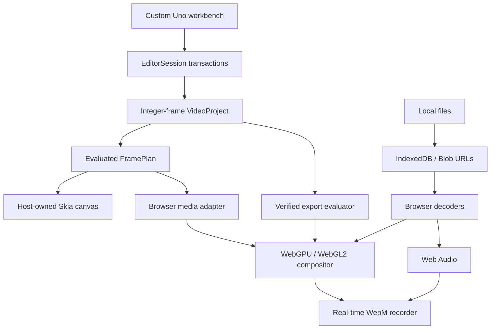

# Architecture

## Model authority and time

C# owns project mutations. Browser modules receive evaluated layers and host rectangles, not editing authority. Compressed media remains outside the managed heap; thumbnails and waveform peaks may cross the bridge. Read-only diagnostic snapshots expose control bounds and state for tests, never a project-mutation endpoint.

Timeline positions are integer frames at an exact rational rate. Source offsets use seconds to accommodate differing source rates. Clips occupy half-open ranges. Drop-frame timecode changes numbering, not frame count. Preview advances from a monotonic clock instead of assuming timely UI ticks. Reverse shuttle uses seeks without reverse audio and is not universally frame-accurate.

`EditorSession.Execute` snapshots, mutates, validates and records bounded history. A failed operation restores its predecessor. Drag previews commit only on release. Validation covers identifiers, references, dimensions, finite values, source handles, nonoverlap, keyframe ordering and bounded counts. Locked tracks reject edits; guarded ripple rejects crossing unselected media rather than guessing a destructive synchronization policy.

Snapshot history favors correctness over memory optimality. Lists and draw-time culling are not a persistent interval-indexed timeline. Structural-delta history is a future optimization.

## Rendering and audio

FramePlanner emits visual layers bottom-to-top and audio subject to mute/solo, sampled keyframes and clip fades. WebGPU caches textures, uniforms and bind groups. Decoded external images upload without a C# pixel readback. Shaders implement transformed quads, crop, alpha and SDR grading. Resources retire when layers leave the active set. Device loss surfaces to the host; automatic reconstruction is not implemented.

WebGL2 provides the corresponding shader path. Canvas 2D is explicitly reduced. Native rendering uses Uno's host-owned Skia canvas, not native WebGPU. Images, titles and generated footage work there; native video decode/encode and live audio are missing adapters. This is not an HDR/ACES/ICC/OCIO pipeline or a claim of colorimetric identity across backends.

Browser audio routes explicit audio clips through gain/pan nodes and measures actual output. Waveforms are reduced from supported decoded PCM within bounded import limits. Missing waveforms are not replaced with invented peaks. The demo's synthesized audio is labeled as generated.

## Storage and export

IndexedDB stores manifests and media; writes observe transaction completion and quota failures surface. `.videospace` exports contain a manifest, not media bytes. Matching an offline filename and byte length relinks an import; this is not a cryptographic media-identity check. Native recovery uses temporary-file rename but does not embed imported image bytes.

C# fixtures independently verify every JavaScript export-evaluation field at boundaries, fades and keyframes. Video export records the preview compositor and a separate audio destination. It is bounded, cancellable and stops when hidden. Decoder readiness, scheduling and MediaRecorder can cause dropped frames or timing drift; this is not deterministic offline encoding.

SRT preserves timed captions. EDL represents cuts on the first video track and rejects speed changes, rather than flattening layered effects. Managed WAV export supports generated sound and rejects imported audio rather than silently dropping it.
