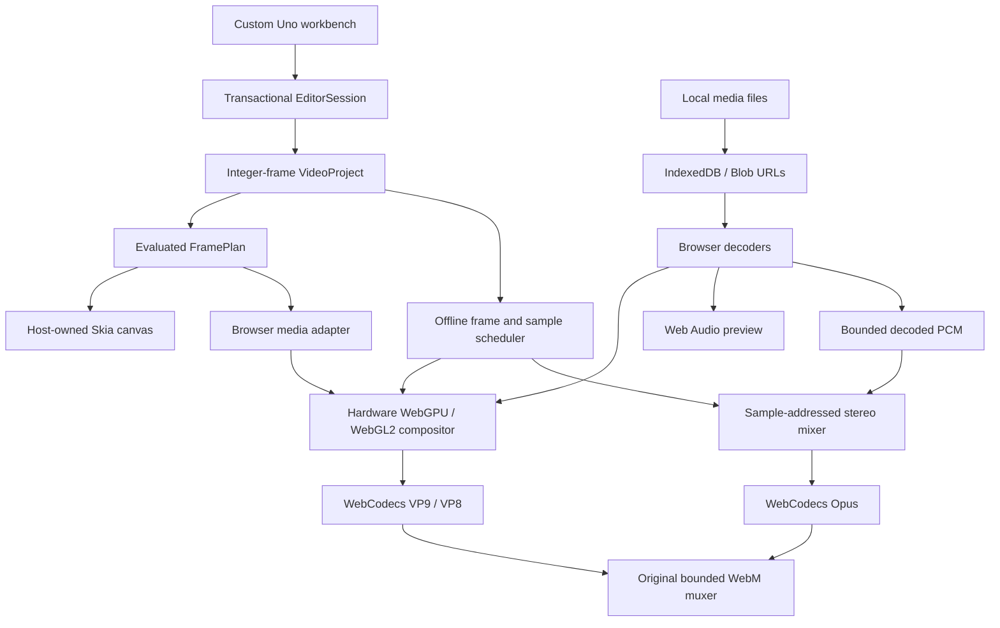

# Architecture

## Editing authority

The C# session is the editing authority. Browser modules receive evaluated layers and host presentation rectangles; they do not issue project mutations through a test endpoint. Compressed media remains outside the managed heap. Small thumbnails and waveform peaks may cross the interop boundary. Read-only diagnostics expose control geometry and project state for actual pointer/keyboard tests.

A timeline coordinate is an integer frame at an exact rational rate. A clip occupies `[Start, Start + Duration)`. Source offsets are seconds so different source rates do not change edit arithmetic. Drop-frame timecode changes numbering, not the frame count. Preview advances from a monotonic clock; reverse shuttle seeks without reverse audio and does not promise universal source-frame precision.

EditorSession snapshots, mutates, validates, then records bounded history. A failed mutation restores the predecessor. Pointer drags preview until release and create one transaction. Validation enforces references, identifiers, dimensions, finite values, source handles, nonoverlap and sorted keyframes. Locked tracks reject edits. Guarded ripple refuses to cross unselected material instead of silently choosing a destructive synchronization policy.

TimelineClipboard owns value copies, not references to mutable source clips. Paste restores necessary track/asset metadata, preserves relative coordinates and keyframes, maps new clip/link identifiers and writes occupied ranges inside a single transaction. Cross-timebase paste rejects implicit rounding. Source bytes remain host-owned.

The initial model uses lists, draw-time culling and serialized history. It is not a persistent interval-indexed timeline or structural-delta journal.

## Rendering

FramePlanner emits visual layers bottom-to-top and audio subject to mute/solo, sampled clip-local keyframes and fades. WebGPU caches per-layer textures, uniform buffers and bind groups; external source images upload without C# readback. WebGL2 supplies the corresponding transform/crop/alpha/SDR grade path. Reported software adapters choose WebGL2 instead of a software WebGPU device. Hardware WebGPU remains the preferred path; `gpu=force` exists for explicit diagnosis.

A minimal WebGPU canvas clear failed on the Linux software runner, independently of application shaders. CI records the actual selected adapter/backend rather than describing fallback validation as physical GPU validation. Graphics errors are surfaced instead of silently exporting missing layers. Full automatic device reconstruction remains future work.

Native composition uses Uno's host-owned Skia canvas, not native WebGPU. It supports generated footage, titles and images. Native video decode, native live audio and native video encoding remain absent. Color correction is SDR parameter grading, not ACES/HDR/ICC/OCIO. Canvas 2D is a reduced preview fallback; offline export rejects it rather than dropping grading effects.

## Offline export

The JavaScript evaluator is compared field-by-field with independent C# frame-plan fixtures. Offline export evaluates every sequence frame in the chosen In/Out range and gives VideoEncoder an explicit integer-microsecond timestamp/duration. Source readiness is awaited, encoder queues are bounded, and VideoFrame instances close immediately after enqueueing.

Imported audio is decoded within explicit compressed/PCM budgets. The mixer computes sample-addressed stereo output, linear source interpolation, clip speed, keyframed gain, fades, mute/solo and pan. AudioData uses planar float32 samples and explicit timestamps. Queue backpressure does not flush Opus mid-stream: flushing pads a codec packet and can disrupt continuous packetization. Both encoders flush only at completion.

The original WebM muxer writes EBML headers, VP8/VP9 and Opus tracks, microsecond-scale timestamps, clusters, cue points, codec delay and discard padding. It bounds packet bytes/count and refuses missing encoder output. Cancellation closes codecs, releases sources and discards partial output without modifying the editing model.

This guarantees an explicit output schedule, not exact source-frame selection for arbitrary containers. Source video still uses browser media-element seeks rather than a full indexed demux/VideoDecoder implementation. The old real-time MediaRecorder module remains experimental; the workbench routes Export to the offline implementation.

## Persistence and interchange

IndexedDB stores manifests and imported files; quota/write errors surface. Exported manifests do not contain media bytes. Offline filename/length matches can relink sources, but are not cryptographic identity checks. Native recovery uses a temporary manifest followed by rename and does not restore imported image bytes automatically.

SRT preserves timed captions. EDL represents cuts on the first video track, rejects speed changes and does not flatten layered effects. Managed WAV export supports generated sound and rejects imported sources; offline WebM mixes imported audio.
